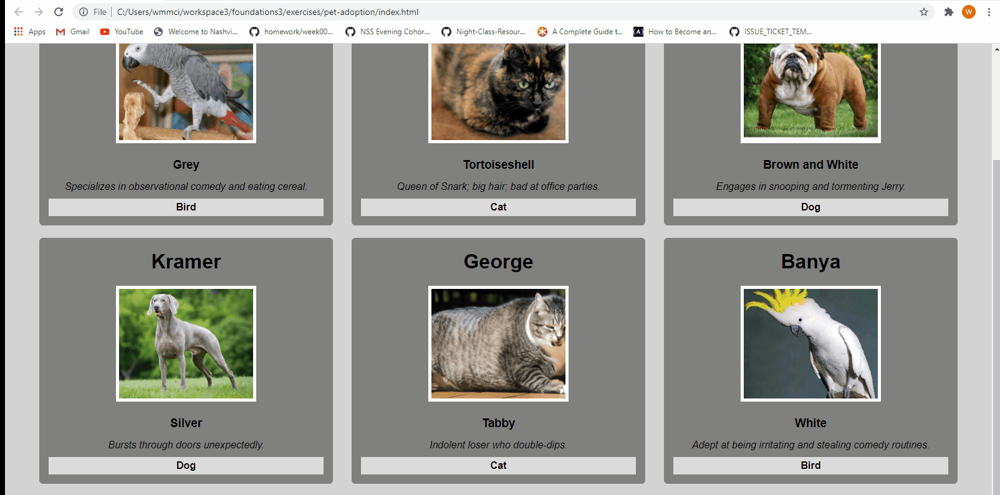

# Pet Adoption

This website was built as a study group assignment during my time at Nashville Software School. Each individual created a website but collaboratively brainstormed and discussed challenges we encountered. The assignment showcases skills with HTML, CSS, and JavaScript. The final iteration is an edited version that incorporates vanilla JavaScript functions that print to the DOM as well as functions that loop through an array to sort the cards by type when the user clicks a button. 

### Demo

### Technologies Used
* HTML
* CSS
* JavaScript

### Contributors / Credits
* [Wanda McInturff](https://github.com/wmmcinturff)

